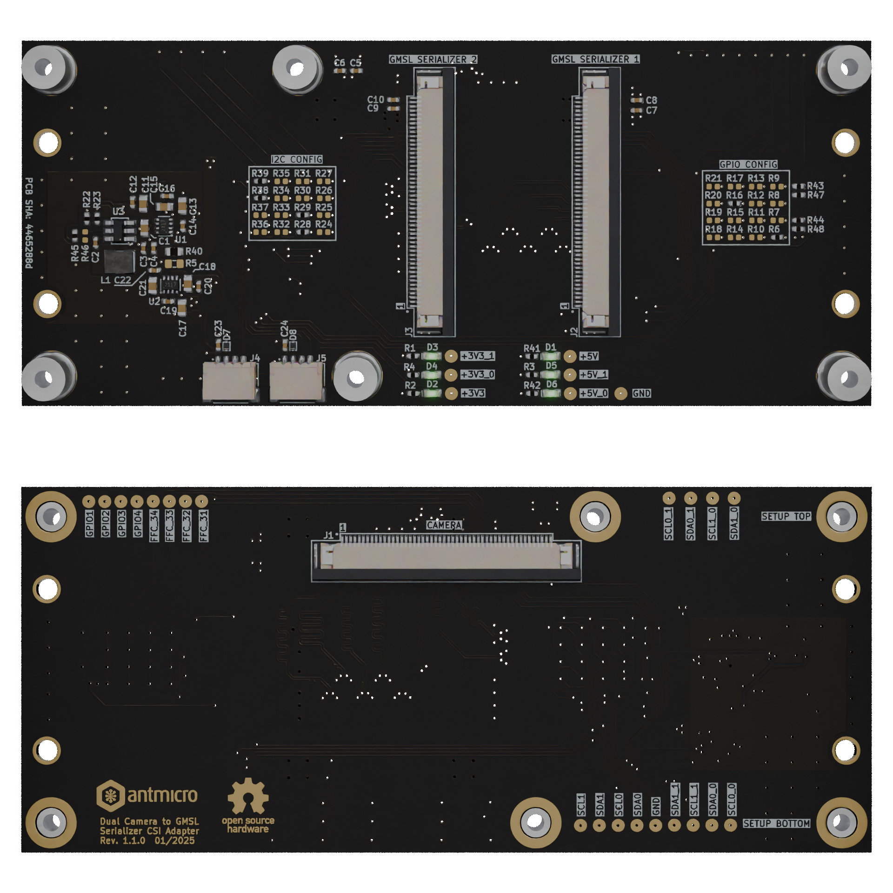

# Dual Camera to GMSL Serializer CSI Adapter

Copyright (c) 2024-2025 [Antmicro](https://www.antmicro.com)

## Overview

This project provides open hardware design files for the Dual Camera to GMSL Serializer CSI Adapter. 
The board is designed to receive two MIPI CSI-2 x2 signals from the [OV5640 Dual Camera Board](https://github.com/antmicro/ov5640-dual-camera-board) and output them to two [GMSL Serializer Boards](https://github.com/antmicro/gmsl-serializer).
The on-board power distribution circuit allows the Dual Camera Board to be powered by one of the selected serializer boards.
The design files were prepared using KiCad 8.x.

## Key features

* 50-pin FFC input connector for the Dual Camera Board connection, exposing two 4-lane MIPI CSI-2 interfaces
* Two 50-pin FFC output connectors for the GMSL Serializer Boards, each supporting a 4-lane MIPI CSI-2 interface
* Two QWIIC connectors for seamless integration of additional I²C devices

## Project structure

The main directory includes KiCad PCB project files, a LICENSE, and a README.
The remaining files are stored in the following directories:

* ``doc`` - contains schematics in PDF format
* ``assets`` - contains visual assets for showcasing this design on [Open Hardware Portal](https://openhardware.antmicro.com) and [System Designer](https://designer.antmicro.com/welcome)

## Licensing

This project is published under the [Apache-2.0](LICENSE) license.
