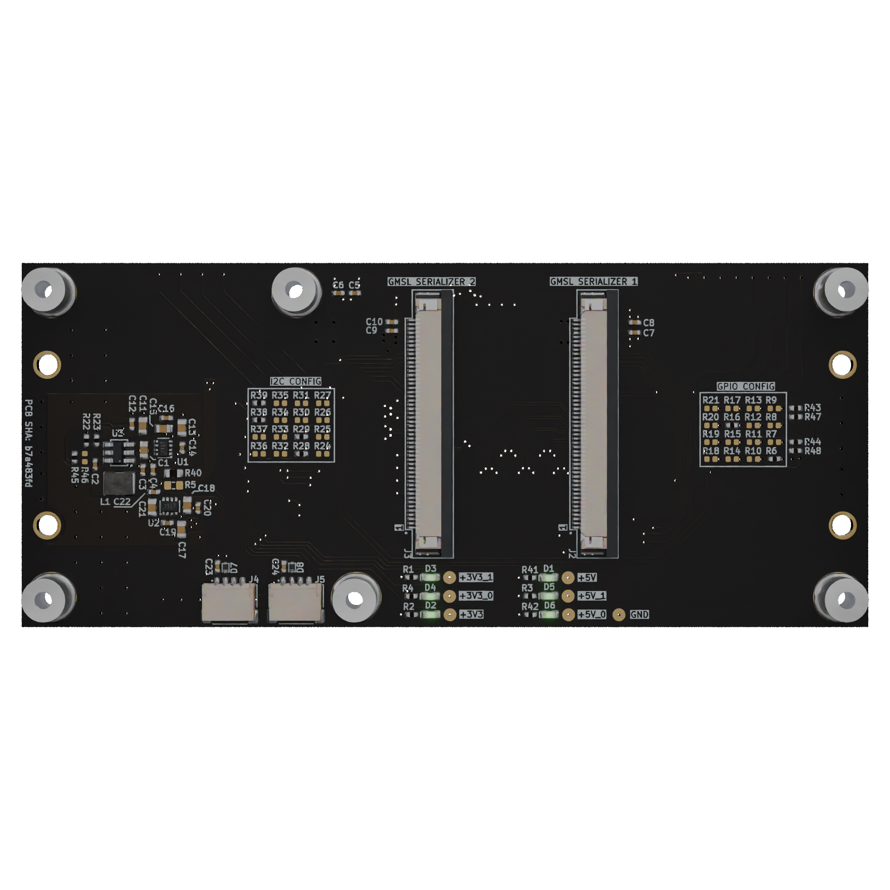

# Dual Camera to GMSL Serializer CSI Adapter

Copyright (c) 2025 [Antmicro](https://www.antmicro.com)

## Overview

This project contains open hardware design files for the Dual Camera to GMSL Serializer CSI Adapter.

The design files were prepared in KiCad 8.

## Project structure

The main directory contains KiCad PCB project files, a LICENSE, and a README.
The remaining files are stored in the following directories:

* `doc` - contains schematics in PDF format
* `assets` - contains visual assets for showcasing this design on [Open Hardware Portal](https://openhardware.antmicro.com).

## Licensing

This project is published under the [Apache-2.0](LICENSE) license.
